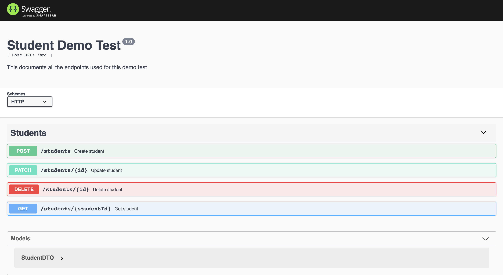

# Student Demo Test

Allows you to create, edit and delete students.


## Architecture

The application is built using 3-tier architecture. I.e. It comprises of a presentation tier, a business or data access tier, and a data tier.

- The client layer contains the UI part of the application and it is written in Vuejs using Nuxtjs framework for SSR.

- The business layer acts as an interface between the Client layer and the Data Access Layer. It is written in Typescript and uses Nestjs framework.

- The Data Access Layer contains methods to connect with database and to perform insert, update, delete, get data from database based on user input data.

## Tech & Stacks

- [Nodejs](https://nodejs.org)
- [Typescript](https://www.typescriptlang.org)
- [Yarn Package Manager](https://yarnpkg.com/en/docs/install)
- [Nestjs](https://nestjs.com)
- [Typeorm](http://typeorm.io)
- [Postgres](http://postgresql.org)
- [Vuejs](https://vuejs.org)
- [Nuxtjs for Vuejs SSR](https://nuxtjs.org)
- [Vuex for Vue state management](http://vuex.vuejs.org)
- [Cloudinary for asset management](https://cloudinary.com)
- [Node Version Manager (nvm)](https://github.com/creationix/nvm)

## Installing

Ensure Nodejs 10.9.0+ and Yarn 1.13.0+ are installed.

```bash
# Verify Nodejs and Yarn installation
# Run the following command on your terminal

$ node -v # 10.9.0
$ yarn -v # 1.13.0

# (Optional) If you have nvm installed, you can just run
$ nvm use
```

Ensure Postgresql has been installed. Follow this [Datacamp tutorial on how to install Postgres on Windows and MacOs](https://www.datacamp.com/community/tutorials/installing-postgresql-windows-macosx)

```bash
# Verify Postgresql installation
# Run the following command on your terminal

$ psql -V # psql (PostgreSQL) 11.2
# Psql comes bundled with your PostgreSQL installation
```

```bash
# Installing dependencies
# Ensure you are in the root of the project
$ yarn install:all

# Or install dependencies for api and client manually
$ cd api && yarn install

# Go back to the root of the application
$ cd ..
$ cd client && yarn install
```

## Building & Starting the application

> Create a copy of `./api/.env-sample` file and rename it to `.env` then fill in the environment variables. Visit [Cloudinary Management Console](https://cloudinary.com/console) to get your environment keys. Ensure you are signed in before accessing the link.
>
> Create a copy of `./client/.env-sample` and rename it to `.env`. You don't have to change the value of `API_BASE_URL` unless you change the host and port for the api server.

### Development environment

```bash
# To run the api and client in parallel in development environment
$ yarn dev

# To start only the api in development environment
$ cd api && yarn start:dev

# To start only the client in development environment
$ cd client && yarn dev
```

### Production environment

```bash
# To build both api and client in parallel
$ yarn build

# To build only the api
$ cd api && yarn build

# To build only the client
$ cd client && yarn build

# To run the api and client in parallel
$ yarn start

# To start only the api
$ cd api && yarn start:prod

# To start only the client
$ cd client && yarn start
```

> Ensure you are in the root of the project before running those commands.

- Client can be accessed via `http://localhost:3000`

- Api can be accessed via `http://localhost:3400`

- API documentation is available via `http://localhost:3400/docs`



> **Note:** An endpoint is missing in the documentation. This is due to the limitation of the framework used.
>
> The endpoint is `GET /api/students` - to get all students.

## Stay in touch

- Author - [Temitayo Fadojutimi](https://about.me/fadojutimitemitayo)
- Twitter - [@adesege\_](https://twitter.com/adesege_)

## License

All rights reserved.
