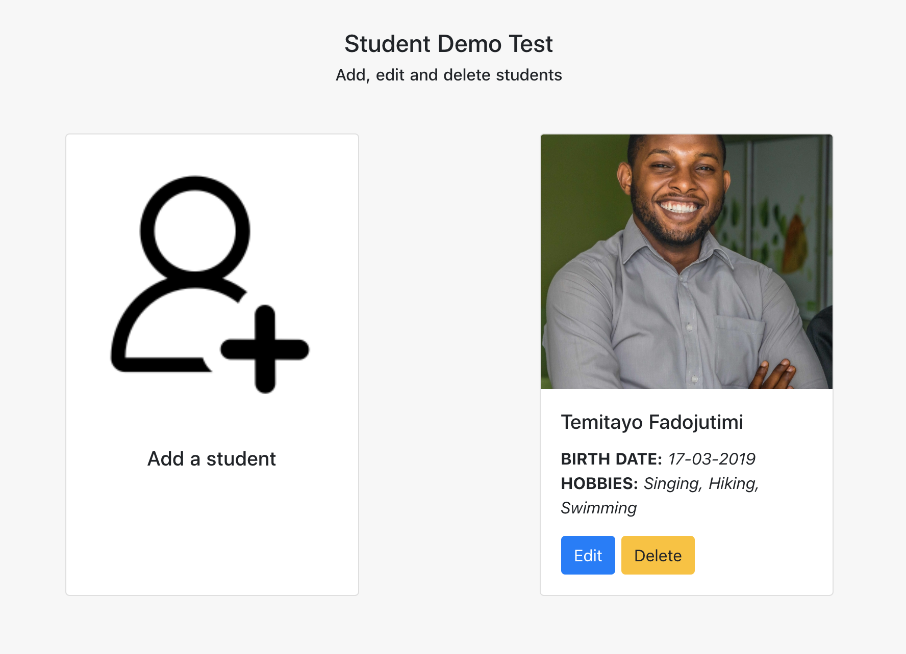

# Student Demo Test

Allows you to create, edit and delete students.



## Architecture

The application is a monolithic application built on Expressjs

## Tech & Stacks

- [Nodejs](https://nodejs.org)
- [Express](https://expressjs.com)
- [Yarn Package Manager](https://yarnpkg.com/en/docs/install)

## Installing

Ensure Nodejs 10.9.0+ and Yarn 1.13.0+ are installed.

```bash
# Verify Nodejs and Yarn installation
# Run the following command on your terminal

$ node -v # 10.9.0
$ yarn -v # 1.13.0

# (Optional) If you have nvm installed, you can just run
$ nvm use
```

```bash
# Installing dependencies
# Ensure you are in the root of the project
$ yarn install
```

## Building & Starting the application

### Development environment

```bash
# To run the application in development environment
$ yarn dev
```

> Ensure you are in the root of the project before running those commands.

- APP can be accessed via `http://localhost:5000`

## Stay in touch

- Author - [Temitayo Fadojutimi](https://about.me/fadojutimitemitayo)
- Twitter - [@adesege\_](https://twitter.com/adesege_)

## License

All rights reserved.
